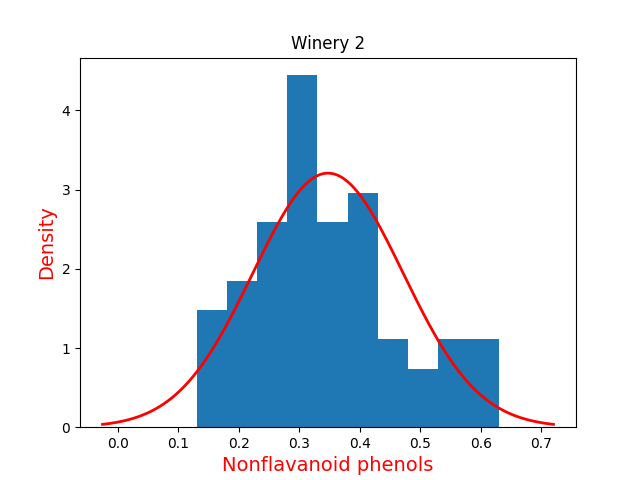

# neighbourhood_watch

## Introduction

The second week's programming assignment for the UCSanDiego online course is centred around the generative models and classifiers.

The project includes the univariate and bivariate models.

## Datasets

The Wine data set is the running example for our discussion of the generative approach to classification.

The data can be downloaded from [the UCI repository](https://archive.ics.uci.edu/ml/datasets/wine), but we have included it in our package. It contains 178 labeled data points, each corresponding to a bottle of wine:

The features (x): a 13-dimensional vector consisting of visual and chemical features for the bottle of wine
The label (y): the winery from which the bottle came (1,2,3)

### Processing methods

#### Loading the dataset

We use a shuffle of a dataset from a fixed permutation. Next, we split the dataset into train and test sections including 130 and 48 data entries respectively.

#### Creating the model

The model runs based on three parameters:
- The probability of each class `pi`
- The mean of each class `mu`
- The variance of each class `var`

Then the prediction is made by comparing the value of *probability of class i* times *probability of point x belonging to class i*:
- Probability of class i: `pi`
- Probability of point x belonging to class i: Derived from the normal distribution based on the values of `mu` and `var`.

The formulae are as follows:
- Univariate:

- Bivariate:

## Dependencies

This project uses Python 3.10.12 to run and for a list of requirements consult the requirements.txt list.

## Run

To run the project, configure the `conf.yaml` with data about the preprocessing method and dataset features. Then run the entry point `main.py`. To get a list of programme arguments, run the entry point with argument `help`.

## Results

### Univariate

Minimum train error and the corresponding test error are respectively 0.2076923076923077 0.16666666666666666, that belongs to feature 6 (Flavanoids).

As an example, the histogram and the normal distribution of this feature for the three classes are:

The amount of separation of the distributions of the classes for this feature are as follows:

Which separates the classes quite better relative to other features.

### Bivariate:
Train errors:

|Features|       0|       1|       2|       3|       4|       5|       6|       7|       8|       9|       10|      11|      12|
|:-:|:-:|:-:|:-:|:-:|:-:|:-:|:-:|:-:|:-:|:-:|:-:|:-:|:-:|
|0|
|1|       0.215|
|2|       0.262|   0.346|
|3|       0.231|   0.323|   0.285|
|4|       0.285|   0.285|   0.415|   0.331|
|5|       0.162|   0.277|   0.238|   0.277|   0.254|
|6|       0.069|   0.192|   0.146|   0.138|   0.138|   0.177|
|7|       0.177|   0.400|   0.323|   0.331|   0.292|   0.308|   0.185|
|8|       0.208|   0.408|   0.354|   0.392|   0.362|   0.338|   0.200|   0.369|
|9|       0.169|   0.185|   0.238|   0.238|   0.231|   0.100|   0.077|   0.215|   0.177|
|10|      0.138|   0.285|   0.269|   0.338|   0.238|   0.200|   0.100|   0.269|   0.323|   0.162|
|11|      0.131|   0.292|   0.215|   0.200|   0.223|   0.231|   0.146|   0.277|   0.308|   0.085|   0.231|
|12|      0.177|   0.169|   0.192|   0.215|   0.246|   0.185|   0.100|   0.154|   0.185|   0.115|   0.108|   0.092|

Test errors:

|Features|       0|       1|       2|       3|       4|       5|       6|       7|       8|       9|       10|      11|      12|
|:-:|:-:|:-:|:-:|:-:|:-:|:-:|:-:|:-:|:-:|:-:|:-:|:-:|:-:|
0|
1|       0.188|
2|       0.250|   0.458|
3|       0.188|   0.333|   0.375|
4|       0.292|   0.229|   0.479|   0.229|
5|       0.104|   0.250|   0.333|   0.250|   0.229|
6|       0.083|   0.188|   0.208|   0.167|   0.146|   0.146|
7|       0.208|   0.438|   0.458|   0.396|   0.375|   0.271|   0.167|
8|       0.167|   0.292|   0.438|   0.417|   0.188|   0.312|   0.167|   0.375|
9|       0.167|   0.229|   0.271|   0.229|   0.208|   0.104|   0.062|   0.250|   0.104|
10|      0.125|   0.333|   0.271|   0.146|   0.146|   0.167|   0.083|   0.292|   0.229|   0.167|
11|      0.104|   0.312|   0.271|   0.188|   0.146|   0.208|   0.146|   0.271|   0.333|   0.188|   0.229|
12|      0.188|   0.188|   0.312|   0.271|   0.292|   0.188|   0.083|   0.229|   0.208|   0.104|   0.146|   0.083|

Minimum train error and the corresponding test error are respectively 0.069 and 0.083, that belong to the feature combination (0, 6) (Alcohol, Flavanoids)

Also the decision boundary for the above feature combination turns out to be:

The distribution separation for the three classes based on this selected feature combination is depicted in the following figure.

Conversely, the minimum test error and the corresponding train error are respectively 0.062 and 0.077, that belong to the feature combination (6, 9) (Flavanoids, Color intensity). But, since we only derive the model from train data, this is not a valid choice.